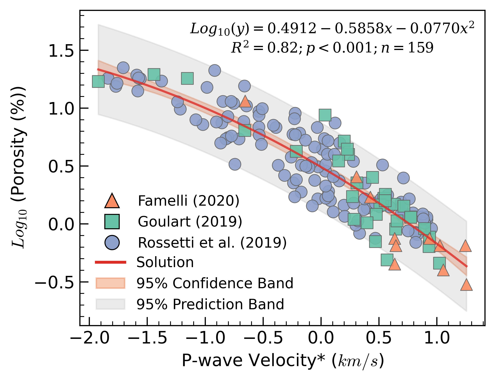

# 🪨 Basalt Petrophysics – Porosity-Permeability Modelling

**Technologies** │ Python • Pandas • Statsmodels • Scikit-learn • Matplotlib • EDA • Orthogonal polynomials

---

## Project Summary  

This notebook investigates how **vp and density controls porosity, and how porosity and bulk-density controls permeability in Paraná-Basin basalts**, a key question for carbon-storage site screening.  
Starting from raw well-log and core data (135 samples), it

1. cleans outliers,  
2. benchmarks naïve raw-polynomial regressions,  
3. introduces **Legendre orthogonalisation** to cure multicollinearity, and  
4. visualises the final cubic fit with confidence & prediction bands.

  

---

## 1 · Why this project matters  

Basaltic formations have emerged as **prime targets for mineral CO₂ trapping** (e.g. CarbFix, Wallula).  
Accurate yet interpretable porosity-permeability models are essential for:

* **Reservoir screening** – quick injectivity estimates before expensive core-flood experiments.  
* **Numerical simulation** – permeability curves parameterise reactive-transport models that forecast CO₂ plume migration.  
* **Research transparency** – orthogonal bases keep geology front-and-centre, avoiding black-box ML when sample size is limited.

---

## 2 · Skills demonstrated  

* **Statistical rigour** – HC1 robust errors, VIF diagnostics, Cook’s-distance checks.  
* **Feature engineering** – Legendre polynomials to stabilise high-degree fits
* **Visual communication** – publication-style plots with dual uncertainty bands and source-coded markers.  

---

## 3 · Key questions answered  

1. *Is a simple cubic enough to model permeability?* – Yes; R² ≈ 0.28 without over-fitting.  
2. *Which variable truly drives permeability?* – Orthogonal fit shows the porosity contrasts are significant; density is secondary.  
3. *How reliable is the model?* – Residual diagnostics confirm acceptable normality, homoscedasticity, and no high-leverage outliers.  
4. *What does uncertainty look like?* – 95 % confidence and prediction envelopes are provided for decision-making margins.
